# Nocturne Database Schema

> Entity-relationship reference for the Nocturne PostgreSQL database, generated from the EF Core model snapshot on the upstream `nightscout/nocturne@main` branch (commit `e7937ef`, 2026-06-25).

**[Open `schema.html`](./schema.html)** for the interactive explorer (search, pan/zoom, per-table column &amp; relationship detail) &mdash; a single self-contained file you can open in any browser or share directly.

**93 tables**, **1227 columns**, **149 foreign-key relationships**, grouped into **12 functional domains**.

All tenant-scoped tables carry a `tenant_id` column and are protected by PostgreSQL Row Level Security (`FORCE ROW LEVEL SECURITY`). Tables use snake_case names; new rows use UUID v7 primary keys. Timestamps are `timestamp with time zone`.

## Contents

- [Domain map](#domain-map)
- [Tenancy & Membership](#tenancy--membership)
- [Identity & Authentication](#identity--authentication)
- [OAuth Server](#oauth-server)
- [Glucose & Vitals (v4)](#glucose--vitals-v4)
- [Insulin & Therapy (v4)](#insulin--therapy-v4)
- [Devices & Status Snapshots (v4)](#devices--status-snapshots-v4)
- [Food](#food)
- [Alerts](#alerts)
- [Trackers](#trackers)
- [Connectors & Migration](#connectors--migration)
- [Audit & Event Logs](#audit--event-logs)
- [Platform & Misc](#platform--misc)

The complete single-diagram source (all 93 tables in one ER diagram) is in [`schema.full.mmd`](./schema.full.mmd).

## Domain map

High-level view of how the domains reference one another (arrows point from the domain holding the foreign key to the domain it references; numbers are distinct FK paths).

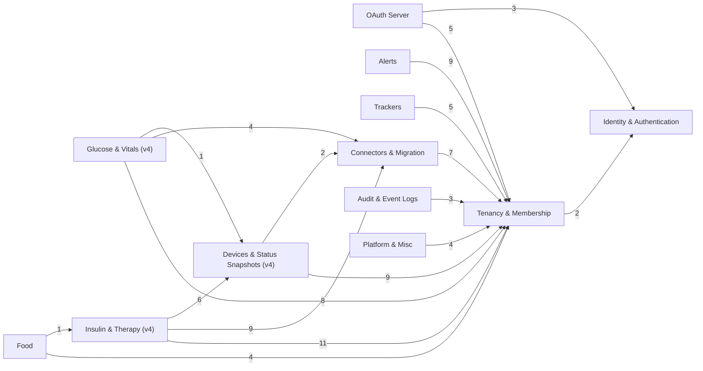

## Tenancy & Membership

Tables: `tenants`, `tenant_members`, `tenant_member_roles`, `tenant_roles`, `member_invites`, `membership_requests`, `tenant_alert_settings`, `tenant_audit_config`, `tenant_data_retention_config`, `tenant_demo_config`, `settings`, `platform_settings`

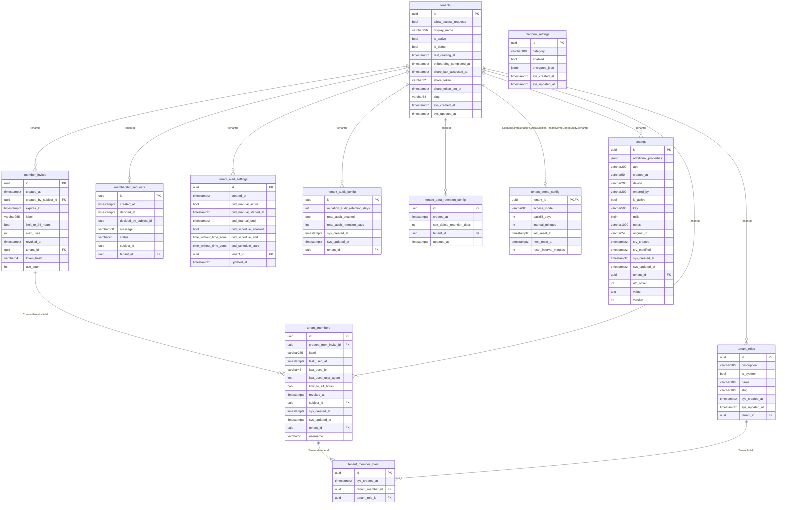

**Cross-domain references**

| Table | Column(s) | References | Domain |
|---|---|---|---|
| `member_invites` | `CreatedBySubjectId` | `subjects` | Identity & Authentication |
| `tenant_members` | `SubjectId` | `subjects` | Identity & Authentication |

## Identity & Authentication

Tables: `subjects`, `subject_roles`, `subject_oidc_identities`, `subject_avatars`, `roles`, `refresh_tokens`, `recovery_codes`, `totp_credentials`, `passkey_credentials`, `oidc_providers`, `auth_audit_log`

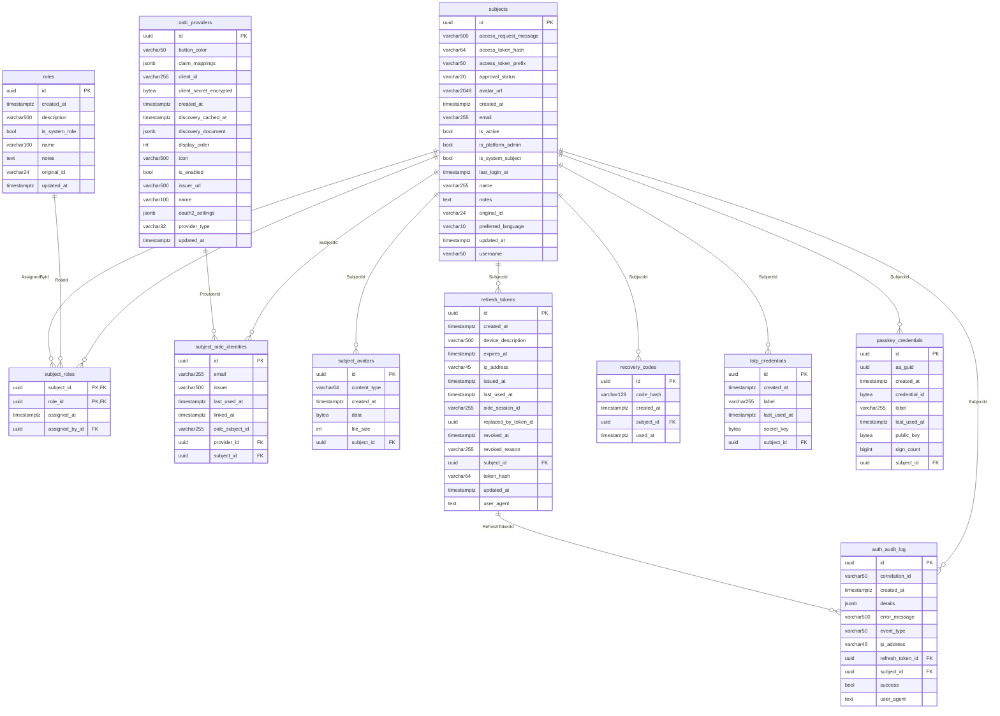

## OAuth Server

Tables: `oauth_clients`, `oauth_authorization_codes`, `oauth_device_codes`, `oauth_grants`, `oauth_refresh_tokens`

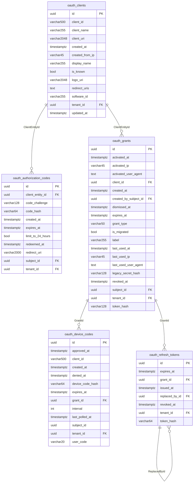

**Cross-domain references**

| Table | Column(s) | References | Domain |
|---|---|---|---|
| `oauth_authorization_codes` | `SubjectId` | `subjects` | Identity & Authentication |
| `oauth_authorization_codes` | `TenantId` | `tenants` | Tenancy & Membership |
| `oauth_clients` | `TenantId` | `tenants` | Tenancy & Membership |
| `oauth_device_codes` | `TenantId` | `tenants` | Tenancy & Membership |
| `oauth_grants` | `CreatedBySubjectId` | `subjects` | Identity & Authentication |
| `oauth_grants` | `SubjectId` | `subjects` | Identity & Authentication |
| `oauth_grants` | `TenantId` | `tenants` | Tenancy & Membership |
| `oauth_refresh_tokens` | `TenantId` | `tenants` | Tenancy & Membership |

## Glucose & Vitals (v4)

Tables: `sensor_glucose`, `meter_glucose`, `calibrations`, `bg_checks`, `compression_low_suggestions`, `heart_rates`, `step_counts`, `body_weights`

```mermaid
erDiagram
  "sensor_glucose" {
    uuid id PK
    jsonb additional_properties
    varchar256 app
    uuid correlation_id FK
    varchar256 data_source
    timestamptz deleted_at
    bool deleted_by_user
    double delta
    varchar256 device
    varchar32 direction
    double filtered
    varchar16 glucose_processing
    varchar64 legacy_id
    double mgdl
    int noise
    uuid patient_device_id FK
    double smoothed_mgdl
    varchar256 sync_identifier
    timestamptz sys_created_at
    timestamptz sys_updated_at
    uuid tenant_id FK
    timestamptz timestamp
    double trend_rate
    double unfiltered
    double unsmoothed_mgdl
    int utc_offset
  }
  "meter_glucose" {
    uuid id PK
    jsonb additional_properties
    varchar256 app
    uuid correlation_id FK
    varchar256 data_source
    timestamptz deleted_at
    bool deleted_by_user
    varchar256 device
    varchar64 legacy_id
    double mgdl
    timestamptz sys_created_at
    timestamptz sys_updated_at
    uuid tenant_id FK
    timestamptz timestamp
    int utc_offset
  }
  "calibrations" {
    uuid id PK
    jsonb additional_properties
    varchar256 app
    uuid correlation_id FK
    varchar256 data_source
    timestamptz deleted_at
    bool deleted_by_user
    varchar256 device
    double intercept
    varchar64 legacy_id
    double scale
    double slope
    timestamptz sys_created_at
    timestamptz sys_updated_at
    uuid tenant_id FK
    timestamptz timestamp
    int utc_offset
  }
  "bg_checks" {
    uuid id PK
    jsonb additional_properties
    varchar256 app
    uuid correlation_id FK
    varchar256 data_source
    timestamptz deleted_at
    bool deleted_by_user
    varchar256 device
    double glucose
    varchar32 glucose_type
    varchar64 legacy_id
    varchar256 sync_identifier
    timestamptz sys_created_at
    timestamptz sys_updated_at
    uuid tenant_id FK
    timestamptz timestamp
    varchar32 units
    int utc_offset
  }
  "compression_low_suggestions" {
    uuid id PK
    double confidence
    bigint created_at
    double drop_rate
    bigint end_mills
    double lowest_glucose
    date night_of
    int recovery_minutes
    bigint reviewed_at
    bigint start_mills
    uuid state_span_id
    varchar20 status
    uuid tenant_id FK
  }
  "heart_rates" {
    uuid id PK
    int accuracy
    int bpm
    varchar256 data_source
    timestamptz deleted_at
    bool deleted_by_user
    varchar255 device
    varchar255 entered_by
    varchar24 original_id
    varchar256 sync_identifier
    timestamptz sys_created_at
    timestamptz sys_updated_at
    uuid tenant_id FK
    timestamptz timestamp
    int utc_offset
  }
  "step_counts" {
    uuid id PK
    varchar256 data_source
    timestamptz deleted_at
    bool deleted_by_user
    varchar255 device
    varchar255 entered_by
    int metric
    varchar24 original_id
    int source
    varchar256 sync_identifier
    timestamptz sys_created_at
    timestamptz sys_updated_at
    uuid tenant_id FK
    timestamptz timestamp
    int utc_offset
  }
  "body_weights" {
    uuid id PK
    numeric body_fat_percent
    varchar50 created_at
    varchar256 data_source
    timestamptz deleted_at
    bool deleted_by_user
    varchar255 device
    varchar255 entered_by
    numeric lean_mass_kg
    bigint mills
    varchar24 original_id
    varchar256 sync_identifier
    timestamptz sys_created_at
    timestamptz sys_updated_at
    uuid tenant_id FK
    int utc_offset
    numeric weight_kg
  }
```

**Cross-domain references**

| Table | Column(s) | References | Domain |
|---|---|---|---|
| `bg_checks` | `CorrelationId` | `decomposition_batches` | Connectors & Migration |
| `bg_checks` | `TenantId` | `tenants` | Tenancy & Membership |
| `body_weights` | `TenantId` | `tenants` | Tenancy & Membership |
| `calibrations` | `CorrelationId` | `decomposition_batches` | Connectors & Migration |
| `calibrations` | `TenantId` | `tenants` | Tenancy & Membership |
| `compression_low_suggestions` | `TenantId` | `tenants` | Tenancy & Membership |
| `heart_rates` | `TenantId` | `tenants` | Tenancy & Membership |
| `meter_glucose` | `CorrelationId` | `decomposition_batches` | Connectors & Migration |
| `meter_glucose` | `TenantId` | `tenants` | Tenancy & Membership |
| `sensor_glucose` | `CorrelationId` | `decomposition_batches` | Connectors & Migration |
| `sensor_glucose` | `PatientDeviceId` | `patient_devices` | Devices & Status Snapshots (v4) |
| `sensor_glucose` | `TenantId` | `tenants` | Tenancy & Membership |
| `step_counts` | `TenantId` | `tenants` | Tenancy & Membership |

## Insulin & Therapy (v4)

Tables: `boluses`, `bolus_calculations`, `basal_injections`, `temp_basals`, `carb_intakes`, `basal_schedules`, `carb_ratio_schedules`, `sensitivity_schedules`, `target_range_schedules`, `therapy_settings`, `patient_insulins`

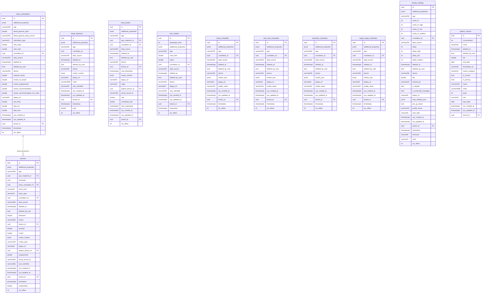

**Cross-domain references**

| Table | Column(s) | References | Domain |
|---|---|---|---|
| `basal_injections` | `TenantId` | `tenants` | Tenancy & Membership |
| `basal_schedules` | `CorrelationId` | `decomposition_batches` | Connectors & Migration |
| `basal_schedules` | `TenantId` | `tenants` | Tenancy & Membership |
| `bolus_calculations` | `CorrelationId` | `decomposition_batches` | Connectors & Migration |
| `bolus_calculations` | `TenantId` | `tenants` | Tenancy & Membership |
| `boluses` | `ApsSnapshotId` | `aps_snapshots` | Devices & Status Snapshots (v4) |
| `boluses` | `CorrelationId` | `decomposition_batches` | Connectors & Migration |
| `boluses` | `DeviceId` | `devices` | Devices & Status Snapshots (v4) |
| `boluses` | `PatientDeviceId` | `patient_devices` | Devices & Status Snapshots (v4) |
| `boluses` | `TenantId` | `tenants` | Tenancy & Membership |
| `carb_intakes` | `CorrelationId` | `decomposition_batches` | Connectors & Migration |
| `carb_intakes` | `TenantId` | `tenants` | Tenancy & Membership |
| `carb_ratio_schedules` | `CorrelationId` | `decomposition_batches` | Connectors & Migration |
| `carb_ratio_schedules` | `TenantId` | `tenants` | Tenancy & Membership |
| `patient_insulins` | `TenantId` | `tenants` | Tenancy & Membership |
| `sensitivity_schedules` | `CorrelationId` | `decomposition_batches` | Connectors & Migration |
| `sensitivity_schedules` | `TenantId` | `tenants` | Tenancy & Membership |
| `target_range_schedules` | `CorrelationId` | `decomposition_batches` | Connectors & Migration |
| `target_range_schedules` | `TenantId` | `tenants` | Tenancy & Membership |
| `temp_basals` | `ApsSnapshotId` | `aps_snapshots` | Devices & Status Snapshots (v4) |
| `temp_basals` | `CorrelationId` | `decomposition_batches` | Connectors & Migration |
| `temp_basals` | `DeviceId` | `devices` | Devices & Status Snapshots (v4) |
| `temp_basals` | `PatientDeviceId` | `patient_devices` | Devices & Status Snapshots (v4) |
| `temp_basals` | `TenantId` | `tenants` | Tenancy & Membership |
| `therapy_settings` | `CorrelationId` | `decomposition_batches` | Connectors & Migration |
| `therapy_settings` | `TenantId` | `tenants` | Tenancy & Membership |

## Devices & Status Snapshots (v4)

Tables: `devices`, `device_events`, `device_status_extras`, `patient_devices`, `patient_records`, `aps_snapshots`, `pump_snapshots`, `uploader_snapshots`, `notes`

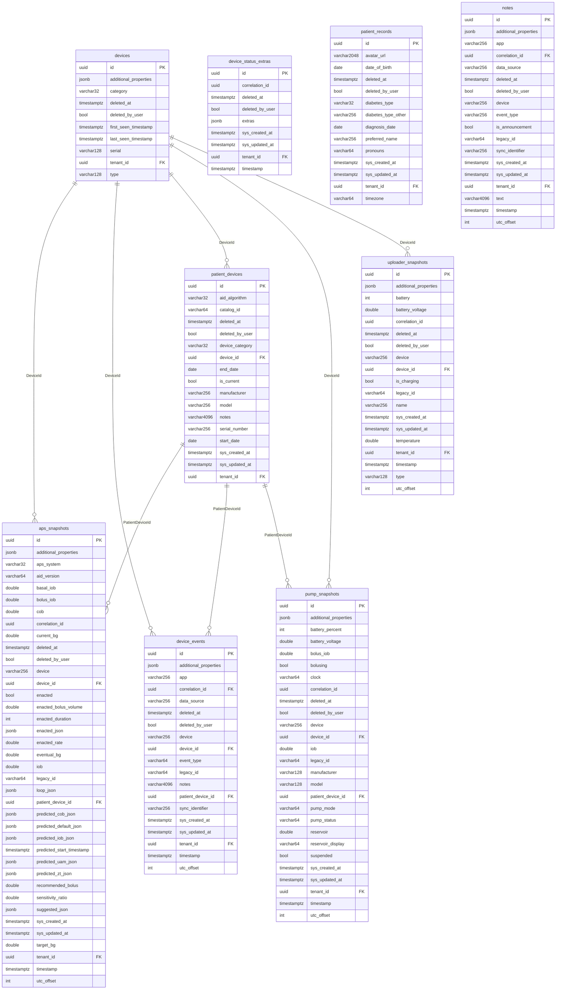

**Cross-domain references**

| Table | Column(s) | References | Domain |
|---|---|---|---|
| `aps_snapshots` | `TenantId` | `tenants` | Tenancy & Membership |
| `device_events` | `CorrelationId` | `decomposition_batches` | Connectors & Migration |
| `device_events` | `TenantId` | `tenants` | Tenancy & Membership |
| `device_status_extras` | `TenantId` | `tenants` | Tenancy & Membership |
| `devices` | `TenantId` | `tenants` | Tenancy & Membership |
| `notes` | `CorrelationId` | `decomposition_batches` | Connectors & Migration |
| `notes` | `TenantId` | `tenants` | Tenancy & Membership |
| `patient_devices` | `TenantId` | `tenants` | Tenancy & Membership |
| `patient_records` | `TenantId` | `tenants` | Tenancy & Membership |
| `pump_snapshots` | `TenantId` | `tenants` | Tenancy & Membership |
| `uploader_snapshots` | `TenantId` | `tenants` | Tenancy & Membership |

## Food

Tables: `foods`, `treatment_foods`, `connector_food_entries`, `user_food_favorites`

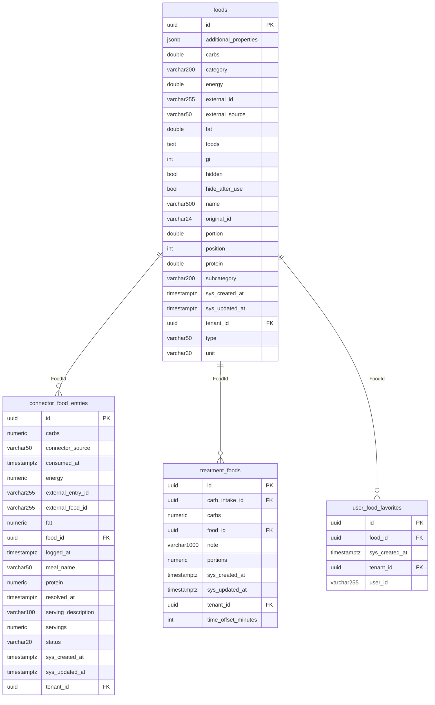

**Cross-domain references**

| Table | Column(s) | References | Domain |
|---|---|---|---|
| `connector_food_entries` | `TenantId` | `tenants` | Tenancy & Membership |
| `foods` | `TenantId` | `tenants` | Tenancy & Membership |
| `treatment_foods` | `CarbIntakeId` | `carb_intakes` | Insulin & Therapy (v4) |
| `treatment_foods` | `TenantId` | `tenants` | Tenancy & Membership |
| `user_food_favorites` | `TenantId` | `tenants` | Tenancy & Membership |

## Alerts

Tables: `alert_rules`, `alert_rule_channels`, `alert_instances`, `alert_deliveries`, `alert_excursions`, `alert_invites`, `alert_condition_timers`, `alert_custom_sounds`, `alert_tracker_state`

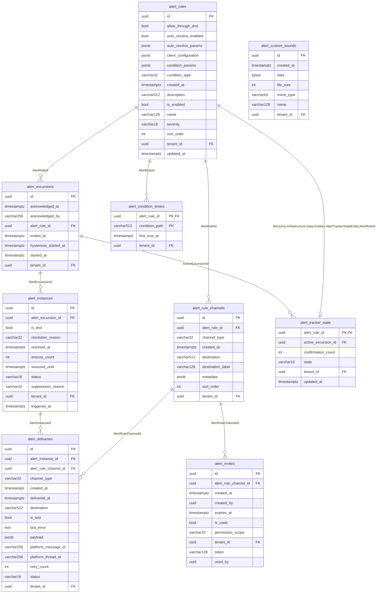

**Cross-domain references**

| Table | Column(s) | References | Domain |
|---|---|---|---|
| `alert_condition_timers` | `TenantId` | `tenants` | Tenancy & Membership |
| `alert_custom_sounds` | `TenantId` | `tenants` | Tenancy & Membership |
| `alert_deliveries` | `TenantId` | `tenants` | Tenancy & Membership |
| `alert_excursions` | `TenantId` | `tenants` | Tenancy & Membership |
| `alert_instances` | `TenantId` | `tenants` | Tenancy & Membership |
| `alert_invites` | `TenantId` | `tenants` | Tenancy & Membership |
| `alert_rule_channels` | `TenantId` | `tenants` | Tenancy & Membership |
| `alert_rules` | `TenantId` | `tenants` | Tenancy & Membership |
| `alert_tracker_state` | `TenantId` | `tenants` | Tenancy & Membership |

## Trackers

Tables: `tracker_definitions`, `tracker_instances`, `tracker_presets`, `tracker_notification_thresholds`, `state_spans`

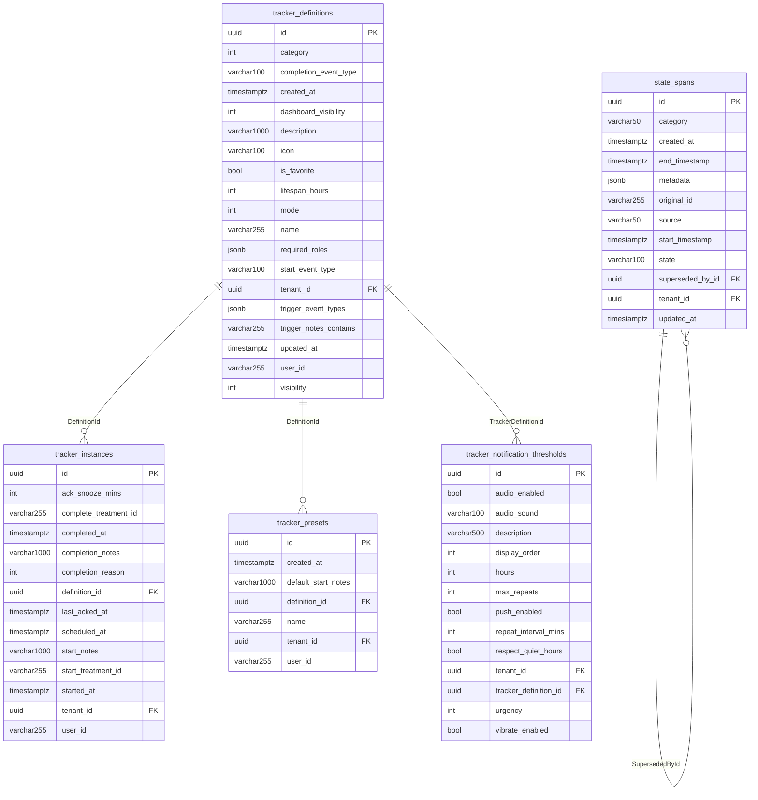

**Cross-domain references**

| Table | Column(s) | References | Domain |
|---|---|---|---|
| `state_spans` | `TenantId` | `tenants` | Tenancy & Membership |
| `tracker_definitions` | `TenantId` | `tenants` | Tenancy & Membership |
| `tracker_instances` | `TenantId` | `tenants` | Tenancy & Membership |
| `tracker_notification_thresholds` | `TenantId` | `tenants` | Tenancy & Membership |
| `tracker_presets` | `TenantId` | `tenants` | Tenancy & Membership |

## Connectors & Migration

Tables: `connector_configurations`, `data_source_metadata`, `migration_runs`, `migration_sources`, `linked_records`, `dedup_reconcile_state`, `decomposition_batches`, `discrepancy_analyses`, `discrepancy_details`

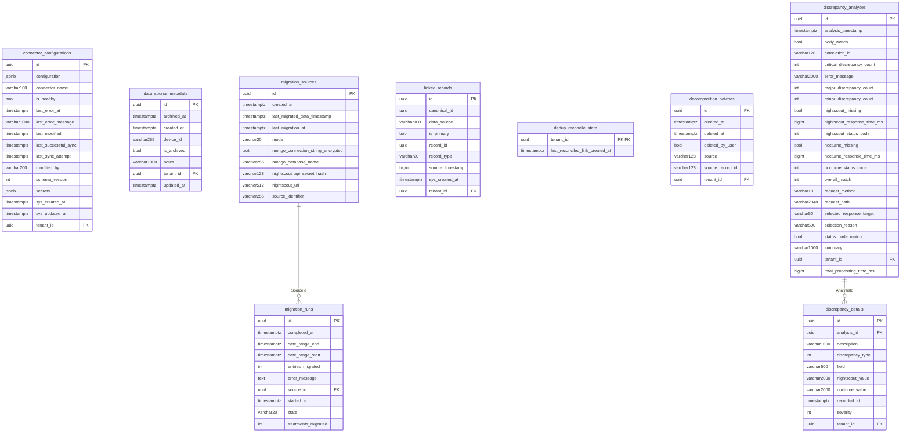

**Cross-domain references**

| Table | Column(s) | References | Domain |
|---|---|---|---|
| `connector_configurations` | `TenantId` | `tenants` | Tenancy & Membership |
| `data_source_metadata` | `TenantId` | `tenants` | Tenancy & Membership |
| `decomposition_batches` | `TenantId` | `tenants` | Tenancy & Membership |
| `dedup_reconcile_state` | `TenantId` | `tenants` | Tenancy & Membership |
| `discrepancy_analyses` | `TenantId` | `tenants` | Tenancy & Membership |
| `discrepancy_details` | `TenantId` | `tenants` | Tenancy & Membership |
| `linked_records` | `TenantId` | `tenants` | Tenancy & Membership |

## Audit & Event Logs

Tables: `mutation_audit_log`, `read_access_log`, `system_events`

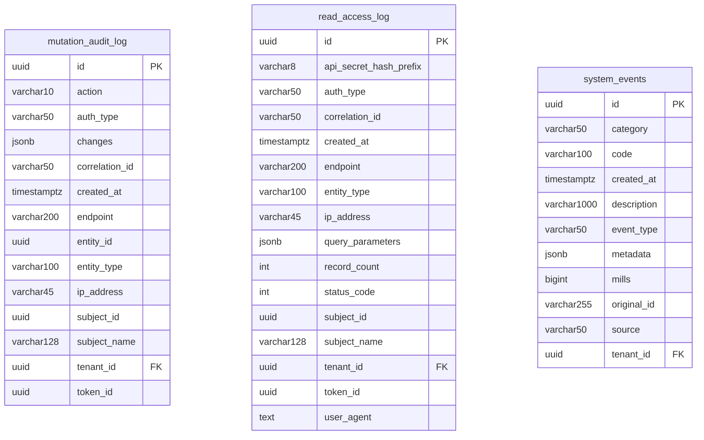

**Cross-domain references**

| Table | Column(s) | References | Domain |
|---|---|---|---|
| `mutation_audit_log` | `TenantId` | `tenants` | Tenancy & Membership |
| `read_access_log` | `TenantId` | `tenants` | Tenancy & Membership |
| `system_events` | `TenantId` | `tenants` | Tenancy & Membership |

## Platform & Misc

Tables: `DataProtectionKeys`, `clock_faces`, `coach_mark_states`, `in_app_notifications`, `timezone_timeline`, `chat_identity_directory`, `chat_identity_pending_links`

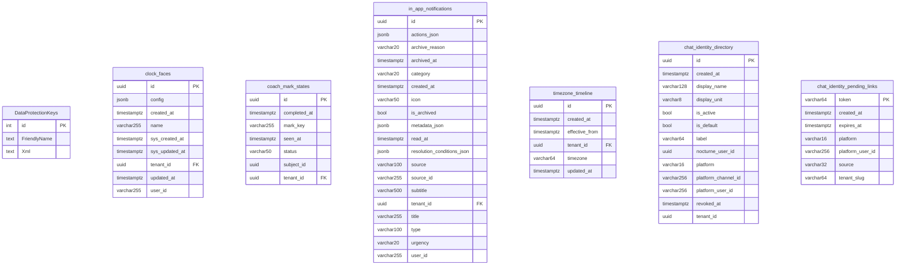

**Cross-domain references**

| Table | Column(s) | References | Domain |
|---|---|---|---|
| `clock_faces` | `TenantId` | `tenants` | Tenancy & Membership |
| `coach_mark_states` | `TenantId` | `tenants` | Tenancy & Membership |
| `in_app_notifications` | `TenantId` | `tenants` | Tenancy & Membership |
| `timezone_timeline` | `TenantId` | `tenants` | Tenancy & Membership |

